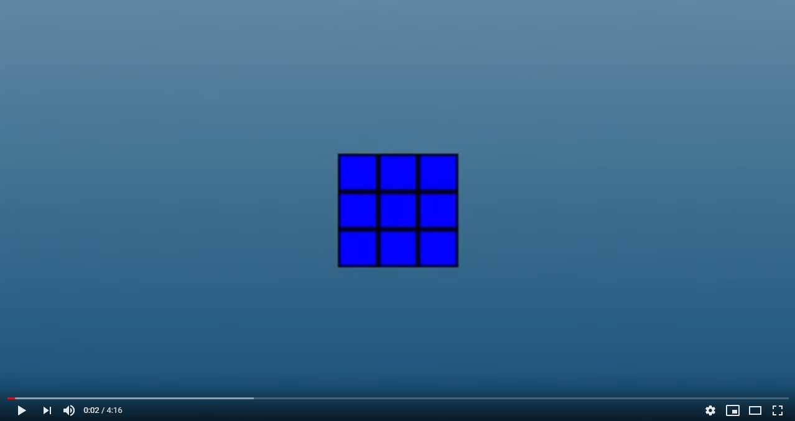

# Cube Connect
Simulator of Rubik's Cube made in C++ and modern OpenGL. All rotation are described in accordance with the official notation found [here](https://ruwix.com/the-rubiks-cube/notation/).

Watch demo

## Controls
To rotate Front, Back, Up, Down, Left or Right face clockwise press respectively F, B, U, D, L or R key. 
For counter counter-clockwise rotation simply hold shift when rotating face.

You can move camera by holding left mouse button or by direction keys on numpad 
alternatively camera can be set to look directly at cube's Front, Right or Up face by pressing 1, 3 or 7 on numpad.

To change cube's orientation simply press X, Y or Z to rotate around corresponding axis.

## How to build

This project uses conan, which is a dependency manager for C++ packages, if it's your first time using this be sure to install conan on your system, and create a default conan profile
To get started with conan start here: https://docs.conan.io/2/tutorial/consuming_packages/build_simple_cmake_project.html

Then in the root directory run:

    git clone 
    cd cube_connect

    conan install . --output-folder=build --build=missing
    cd build

    cmake .. -DCMAKE_TOOLCHAIN_FILE=conan_toolchain.cmake -DCMAKE_BUILD_TYPE=Release
    cmake --build .

    cd ..
    ../build/src/cube_connect

## Design

### Architecture

To get started start reading `main.cpp` where you'll notice that some basic opengl boilerplate is called and then a `Scene` is created.

The idea behind a scene system, is that an experience is restricted within some world/context that doesn't change too much, for example
suppose we have a game where you move around trying to score points and at the end of that the winner is displayed, this setup allows for
two distinct scenes one for the actual gameplay and one for the win screen. 

If we already have a scene system built, then we can also just use it as a single use solution where we just have one scene,
this allows us to create new experiences faster when much of the architecture. In general a scene system is overkill for games that 
only use one scene, but in another sense its not overkill because as a programmer that creates experiences we can drop it in and go.

Either way a scene system is composed of Objects which are in-turn composed of Components , for example start by looking in `MainScene.cpp` and see how the camera is made up of two components
an Object that we store a camera and a third person controller component inside. Additionally you can think of Scenes, Objects and Components simply as containers, and at the top level an update function is called
on the scene, which then iterates through its objects updating each one of those, which in turn simply updates each of its components. 

This design could have been simplified just by making each of these `Nodes` and then recursively calling update on them, which induces the same structure, so there is room for simplification. 
Note that in this application the structure just mentioned is actually done through Scene -> Objects -> Components through `ProcessFrame` or `Update` calls.

The design also has structures that manage these objects that we create, normally we would create objects and perhaps store them in a vector, but instead we employ ambient structures that
when a new object is called, they automatically get added to, specifically this is `ObjectManager`, then when a scene calls `Run` it simply calls `ProcessFrame` on the `ObjectManager`. 

The benefit of these structures is that when writing scene code, we don't have to care about how and when they will get processed and updated, we only care about what the scene is composed of the only benefit
these structures have is to make related code appear in related places, and they don't necessarily have to exist for things to run correctly.

Data flows through application first through the glfw callbacks on mouse move and keyboard press which updates the global input variable `g_Input` as defined in `main.cpp`. Because the input object is global this means 
that it's not clear who or what touches the variable, but it becomes obvious in the context of this application, as when the mouse moves we can see that the camera changes position, and when keys are pressed the rubicks cube
turns, by devling into the code a little further we can find that `g_Input` is used in the `ThirdPersonController` which reads the mouse deltas and updates the rotation values.

Also inside of the rubiks cube component we can see that `g_Input` is read which allows us to update faces when corresponding keys are pressed.

Rotations are measured around axis lines, for example if you read something of the form `x_rotation` this is talking about pitch and `y_rotation` is talking about yaw.

### Object Communication

Each object has its own instance of a `MessageManager`, and each `Component` has a function called `CreateConnectors` which takes in a `MessageManager`, and it allows the `Component` to call `Make` on the passed in message manager, which creates
something called a `MessageOut` which simply allows the `Component` to send a message to the `MessageManager` after reading a bunch of class names things get confusing, but this is actually simple, consider a real life human parent giving a child 
a radio and telling them, if you want to tell me anything just press the talk button and I'll be able to hear you.

Focusing specifically on the rubiks cube object it has a list of moves that need to be performed, for example if you press f on the keyboard the front face rotates clockwise, which is done through a call to `RotateFace`
this in-turn calls `UpdateTextRenderer` which in-turn calls `Send` on it's `MessageOut`, when send is called it simply calls `ForwardMessage` to the associated `MessageManager` 
Note that the `MessageManager` stores a mapping of `MessageOut` to a vector of `MessageIns` which can be sanely thought of as your walkie talkie and all the frequencies you can communicate on or just as the subscribers to that source
and `FowardMessage` calls and in-turn calls `Receive` for each interested parties
`MessageOut` as it.

Also each object has a function called `Connect` which creates a subscription from a `MessageOut` to a `MessageIn`. Concretely this is used in the text render, for example `TextRenderer` defines a `MessageIn` called `TextIn`
while on the other hand the `RubiksCube` object has a `MessageOut` so that finally in `MainScene.cpp` they are both connected, and the `TextRenderer`'s receive is a simple state update to it's current text attribute, this shows how communication between two components can occur.

The benefit of this system is that it keeps different `Components` decoupled, while also allowing them to communicate, a naive solution to this is just giving the `RubiksCube` access to the `TextRenderer`, but this approach allows for
many different systems to communicate all using the same logic while keeping them decoupled.

### Graphics

The graphics are handled by opengl, a base `Drawable` class is created, this class represents a single objects that uses only one shader through the programs lifetime, such as the skybox, there is also a text renderer.

## Developing

To properly load resources and shaders source code make sure you have your executable path set up correctly - preferably pointing to the root of a project. Or copy 'resources' and 'src/shaders' directories to your build target directory.
